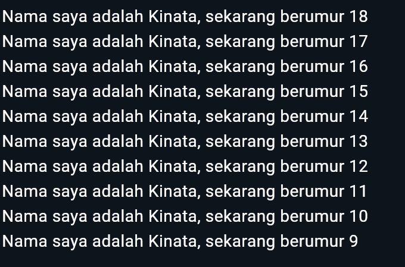

# Laporan Praktikum

NIM : 2241720087 <br>
Nama : Kinata Dewa Ariandi <br>
Kelas : TI 3B

## Module 2

Pengantar Bahasa Pemrograman Dart

### Soal

1. **Kode**:
   ```dart
   void main() {
      for (int i = 18; i >= 9; i--) {
         print('Nama saya adalah Kinata, sekarang berumur $i');
      }
   }
   ```

Hasil :


2. karena Flutter dibangun di atas Dart, sehingga seluruh kode aplikasi Flutter ditulis menggunakan bahasa Dart. Tanpa pemahaman yang baik tentang Dart, pengembang akan kesulitan menulis, membaca, dan memahami kode dalam proyek Flutter.

3. Dart adalah bahasa pemrograman modern yang menawarkan fitur-fitur unggul seperti alat produktivitas, garbage collection, anotasi tipe yang opsional, type-safe, dan portabilitas. Dart mendukung pengembangan aplikasi untuk web, mobile, dan desktop, serta menjadi bahasa dasar dari framework Flutter. Memahami Dart sangat penting untuk pengembangan aplikasi yang efektif menggunakan Flutter.

   Di Dart, operator adalah metode khusus yang didefinisikan dalam class. Misalnya, penggunaan x == y setara dengan memanggil metode x.==(y). Semua tipe data di Dart adalah objek, berbeda dengan bahasa seperti Java yang memiliki tipe data primitif. Dart memungkinkan modifikasi operator sesuai kebutuhan, dan menyediakan operator aritmatika umum seperti + (penjumlahan) dan - (pengurangan).

   Fungsi Utama (main):

   Tipe Data Kembalian: void menunjukkan bahwa fungsi tidak mengembalikan nilai apapun.
   Nama Fungsi: main adalah nama fungsi utama yang dieksekusi pertama kali oleh Dart VM.
   Parameter: Tanda kurung kosong () menunjukkan fungsi ini tidak menerima parameter.
   Kurung Kurawal: {} digunakan untuk menentukan awal dan akhir blok kode fungsi.
   Fungsi vs Method:

   Fungsi: Berada di luar class dan bisa dipanggil secara global. Contoh: main adalah fungsi global.
   Method: Terikat pada class dan memiliki akses ke instance class melalui keyword this.
