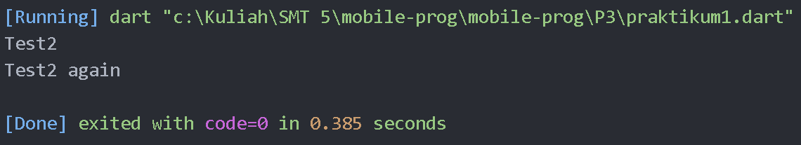
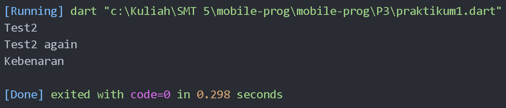
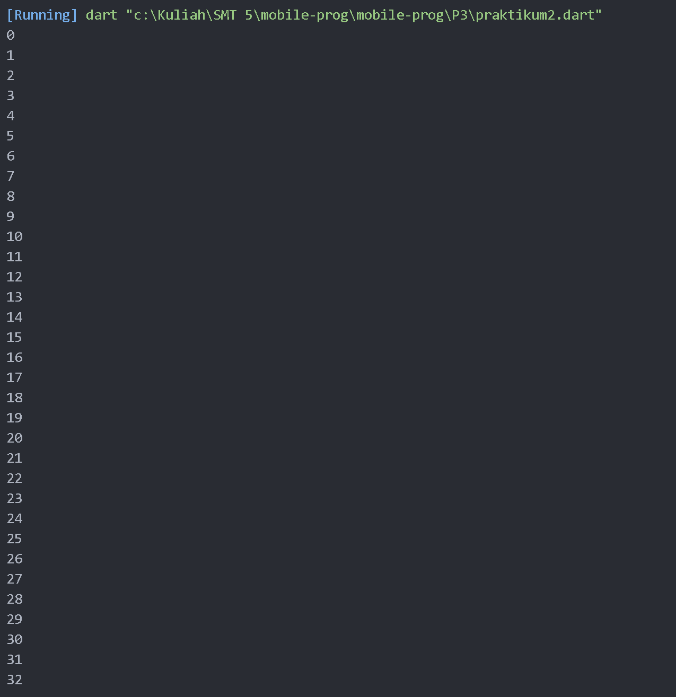
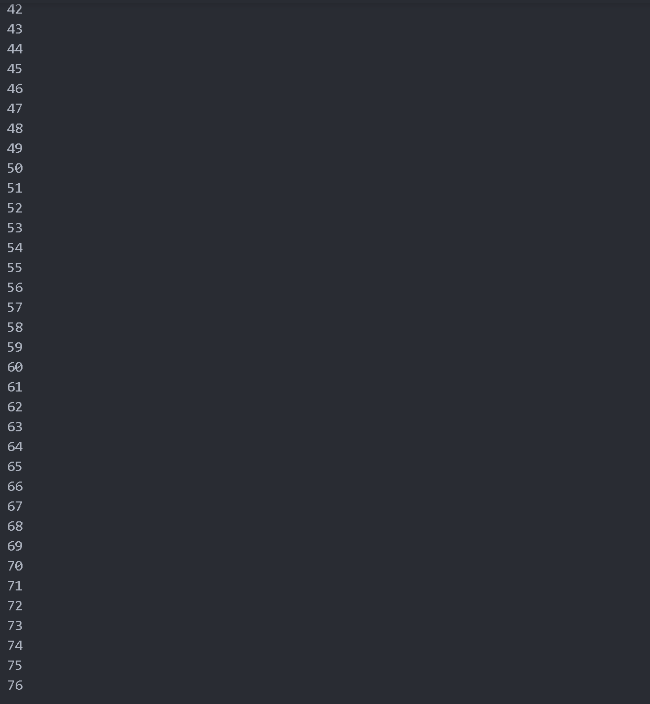
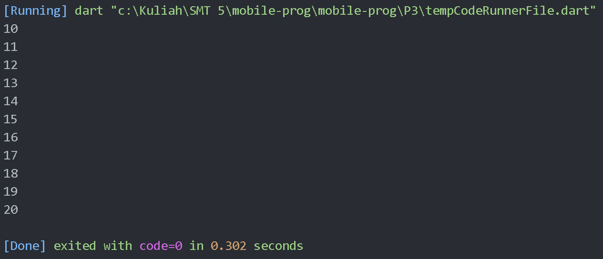
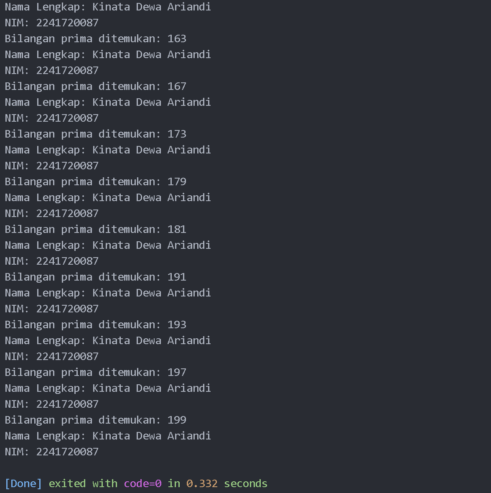

# Laporan Praktikum

NIM : 2241720087 <br>
Nama : Kinata Dewa Ariandi <br>
Kelas : TI 3B

## Module 3

### Praktikum 1 : Menerapkan Control Flows ("if/else")

langkah 1:
   ```dart
void main() {
  String test = "test2";
  if (test == "test1") {
    print("Test1");
  } else if (test == "test2") {
    print("Test2");
  } else {
    print("Something else");
  }

  if (test == "test2") print("Test2 again");
}
   ```


Langkah 2 : 


menampilkan hasil diatas karena variabel tes Variabel test bernilai "test2". Pada blok if-else, kondisi "test2" terpenuhi, sehingga mencetak "Test2".Kondisi if kedua juga terpenuhi, sehingga mencetak "Test2 again".

Langkah 3 :

Kode yang diberikan eror karena bertabrakan.

   ```dart

bool test3 = true;
  if (test3) {
    print("Kebenaran");
  }
```
Kode diatas adalah kode yang sudah saya ubah dan mrnghasilkan output 



### Praktikum 2: Menerapkan Perulangan "while" dan "do-while"

langkah 1:
sudah

Langkah 2:
kode program yang diberikan salah karena nilai counter belum dideklarasikan. Berikut kode yang sudah saya perbaiki

```dart
void main() {
  int counter = 0;
  while (counter < 33) {
    print(counter);
    counter++;
  }
}
```

hasil : <br>


Langkah 3: <br>



### Praktikum 3: Menerapkan Perulangan "for" dan "break-continue"

Langkah 1 :
```dart
void main() {
  for (int index = 10; index < 27; index++) {
    print(index);
  }
}
```

Langkah 2 : 
Kode tersebut mencetak angka dari 10 hingga 26. Setiap kali loop berjalan, nilai index bertambah 1 sampai mencapai 27, di mana loop berhenti. Output akhirnya adalah daftar angka dari 10 sampai 26.

Langkah 3 : 
kode saya ubah menjadi 
```dart
void main() {
  for (int index = 10; index < 27; index++) {
    if (index == 21) {
      break;
    } else if (index > 1 && index < 7) {
      continue;
    }
    print(index);
  }
}
```

hasil : 


### Tugas Praktikum
1. Sudah <br>

2. 
```dart
bool isPrime(int number) {
  if (number < 2) {
    return false;
  }
  for (int i = 2; i <= number ~/ 2; i++) {
    if (number % i == 0) {
      return false;
    }
  }
  return true;
}

void main() {
  String namaLengkap = 'Kinata Dewa Ariandi';
  String nim = '2241720087';

  for (int i = 0; i <= 201; i++) {
    if (isPrime(i)) {
      print('Bilangan prima ditemukan: $i');
      print('Nama Lengkap: $namaLengkap');
      print('NIM: $nim');
    }
  }
}
```


