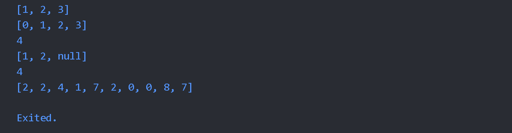

# Laporan Praktikum

NIM : 2241720087 <br>
Nama : Kinata Dewa Ariandi <br>
Kelas : TI 3B
#
##  Praktikum 1: Eksperimen Tipe Data List

Langkah 1 
```dart
void main() {
  var list = [1, 2, 3];
  assert(list.length == 3);
  assert(list[1] == 2);
  print(list.length);
  print(list[1]);

  list[1] = 1;
  assert(list[1] == 1);
  print(list[1]);
}
```
<br>
Kode diatas merupakan contoh penggunaan tipe data list pada dart. list adalah kumpulan data yang disusun secara berurutan. pada kode diatas, list berisi 3 data yaitu 1, 2, dan 3. kemudian dilakukan pengecekan panjang list dengan menggunakan list.length yang menghasilkan output 3. kemudian dilakukan pengecekan data pada index ke-1 dengan menggunakan list[1] yang menghasilkan output 2. kemudian dilakukan perubahan data pada index ke-1 dengan menggunakan list[1] = 1. kemudian dilakukan pengecekan data pada index ke-1 dengan menggunakan list[1] yang menghasilkan output 1.
Langkah 2 : 
Hasil


penjelasan : 
Outputnya 3 2 1 karena list berisi 3 elemen, elemen ke-1 awalnya 2, lalu diubah menjadi 1.

Langkah 3 : 
```dart
void main() {
  final List<String?> list = List.filled(5, null);
  list[1] = "Kinata Dewa Ariandi";
  list[2] = "2241720087";

  assert(list.length == 5);
  assert(list[1] == "Kinata Dewa Ariandi");
  assert(list[2] == "2241720087");

  print(list.length);
  print(list[1]);
  print(list[2]);
}
```
Hasil : 


##  Praktikum 2: Eksperimen Tipe Data Set

Langkah 1 : 
```dart
void main() {
  var halogens = {'fluorine', 'chlorine', 'bromine', 'iodine', 'astatine'};
  print(halogens);
}
```

Langkah 2 : 

menampilkan/print semua isi pada halogens <br> <br>

Langkah 3 : 
```dart
void main() {
  var halogens = {'fluorine', 'chlorine', 'bromine', 'iodine', 'astatine'};
  print(halogens);

  var names1 = <String>{}; // Set<String>
  Set<String> names2 = {}; // Set<String>
  var names3 = {}; // Creates a map, not a set.

  names1.add("Kinata Dewa Ariandi");
  names1.add("2241720087");

  // Menambahkan elemen nama dan NIM ke names2
  names2.addAll(
      {"Kinata Dewa Ariandi", "2241720087"}); // Ganti dengan nama dan NIM Anda

  print(names1);
  print(names2);
  print(names3); // Ini adalah map kosong, bukan set
}
```

Hasil : 


## Praktikum 3: Eksperimen Tipe Data Maps

Langkah 1 : 
```dart
void main() {
  var gifts = {
    // Key:    Value
    'first': 'partridge',
    'second': 'turtledoves',
    'fifth': 1
  };

  var nobleGases = {
    2: 'helium',
    10: 'neon',
    18: 2,
  };

  print(gifts);
  print(nobleGases);
}

```

Langkah 2: 

jawab : Kode diatas merupakan contoh penggunaan Map di Dart. Map adalah tipe data yang digunakan untuk menyimpan data dalam bentuk pasangan key-value. Key adalah identifier yang digunakan untuk mengakses value. Key harus unik, sedangkan value bisa berupa tipe data apapun. Pada kode diatas, terdapat dua contoh penggunaan Map. Pada contoh pertama, gifts, key berupa string dan value berupa string juga. Sedangkan pada contoh kedua, nobleGases, key berupa integer dan value berupa string.

Langkah 3 :

```dart
void main() {
  var gifts = {
    'first': 'partridge',
    'second': 'turtledoves',
    'fifth': 'golden rings',
  };

  var nobleGases = {
    2: 'helium',
    10: 'neon',
    18: 'argon',
  };

  print(gifts);
  print(nobleGases);

  var mhs1 = Map<String, String>();
  mhs1['name'] = 'Kinata Dewa Ariandi';
  mhs1['NIM'] = '2241720087';

  var mhs2 = Map<int, String>();
  mhs2[1] = 'Kinata Dewa Ariandi';
  mhs2[2] = '2241720087';

  // Menambahkan elemen pada gifts dan nobleGases
  gifts['third'] = 'three French hens';
  nobleGases[1] = 'hydrogen';

  print(gifts);
  print(nobleGases);
  print(mhs1);
  print(mhs2);
}

```

## Praktikum 4: Eksperimen Tipe Data List: Spread dan Control-flow Operators

Langkah 1 : 
```dart
var list = [1, 2, 3];
var list2 = [0, ...list];
print(list1);
print(list2);
print(list2.length);
```
Langkah 2 : 


Jawab : Kode nya erorr karena tidak ada penamaan list1.

Langkah 3 : 
```dart
void main() {
  var list = [1, 2, 3];
  var list2 = [0, ...list];
  print(list1);
  print(list2);
  print(list2.length);

  list1 = [1, 2, null];
  print(list1);
  var list3 = [0, ...?list1];
  print(list3.length);
}
```
jawab : 
Terjadi error karena List 1 belum dideklarasikan

setelah diperbaiki : 
```dart
void main() {
  var list = [1, 2, 3];
  var list2 = [0, ...list];
  print(list);
  print(list2);
  print(list2.length);

  var list1 = [1, 2, null];
  print(list1);
  var list3 = [0, ...?list1];
  print(list3.length);
}
```
Hasil : 


Menambahkan NIM : 
```dart
void main() {
  var list = [1, 2, 3];
  var list2 = [0, ...list];
  print(list);
  print(list2);
  print(list2.length);

  var list1 = [1, 2, null];
  print(list1);
  var list3 = [0, ...?list1];
  print(list3.length);

  var nim = [2, 2, 4, 1, 7, 2, 0, 0, 8, 7];
  var nimList = [...nim];
  print(nimList);
}
```

Hasil : 


Langkah 4 : <br>
Terjadi error Karena variabel promoActive tidak didefinisikan


```dart
void main() {
  var list = [1, 2, 3];
  var list2 = [0, ...list];
  print(list);
  print(list2);
  print(list2.length);

  var list1 = [1, 2, null];
  print(list1);
  var list3 = [0, ...?list1];
  print(list3.length);

  var nim = [2, 2, 4, 1, 7, 2, 0, 0, 8, 7];
  var nimList = [...nim];
  print(nimList);

  var nav = ['Home', 'Furniture', 'Plants', if (promoActive) 'Outlet'];
  print(nav);
}
```
Setelah Diperbaiki : 
```dart
 bool promoActive = false;
  var nav = ['Home', 'Furniture', 'Plants', if (promoActive) 'Outlet'];
  print(nav);
```
Hasil : 


Langkah 5 : 
<br>
Terjadi error Karena Variabel Login tidak didefinisikan sehingga tidak bisa di cek apakah variabel login memiliki value 'Manager' atau tidak

Perbaikan kode dan lpgin kondisi lain: 
```dart
  bool promoActive = false;
  var nav = ['Home', 'Furniture', 'Plants', if (promoActive) 'Outlet'];
  print(nav);

  var login = 'Manager';
  var nav2 = [
    'Home',
    'Furniture',
    'Plants',
    if (login == 'Manager') 'Inventory'
  ];
  print('Nav2 ketika login sebagai Manager: $nav2');

  login = 'User';
  nav2 = ['Home', 'Furniture', 'Plants', if (login == 'Manager') 'Cafe'];
  print('Nav2 ketika login = User: $nav2');
```

Hasil : 


Langkah 6 : 
```dart
var listOfInts = [1, 2, 3];
  var listOfStrings = ['#0', for (var i in listOfInts) '#$i'];
  assert(listOfStrings[1] == '#1');
  print(listOfStrings);
```
Hasil : 

Collection For digunakan untuk membuat collection baru dengan menambahkan atau mengubah item yang ada di collection yang sudah ada.

## Praktikum 5: Eksperimen Tipe Data Records

Langkah 1 : 
```dart
void main() {
  var record = ('first', a: 2, b: true, 'last');
print(record);
}
```

Langkah 2 : 

Jawba : Kode diatas merupakan contoh penggunaan record syntax yang digunakan untuk membuat object yang tidak dapat diubah nilainya

Langkah 3 : 
```dart
(int, int) tukar((int, int) record) {
  var (a, b) = record;
  return (b, a);
```
Hasil : 


Langkah 4 : 
```dart
// Record type annotation in a variable declaration:
(String, int) mahasiswa;
print(mahasiswa);
```

jawab : Terjadi error Karena variabel mahasiswa tidak diinisialisasi dengan nilai

Perbaikan kode : 
```dart
(String, int) mahasiswa = ('Kinata Dewa Ariandi', 2241720087);
  print(mahasiswa);
  ```
Hasil : 


Langkah 5 : 
```dart
var mahasiswa2 = ('Kinata Dewa Ariandi', a: 2241720087, b: true, 'last');

  print(mahasiswa2.$1); // Print 'first'
  print(mahasiswa2.a); // Print 2
  print(mahasiswa2.b); // Print true
  print(mahasiswa2.$2); // Print 'last'
}

(int, int) tukar((int, int) record) {
  var (a, b) = record;
  return (b, a);
  ```
Hasil : 


## Tugas Praktikum
1. Silakan selesaikan Praktikum 1 sampai 5, lalu dokumentasikan berupa screenshot hasil pekerjaan Anda beserta penjelasannya!
2. Jelaskan yang dimaksud Functions dalam bahasa Dart!
3. Jelaskan jenis-jenis parameter di Functions beserta contoh sintaksnya!
4. Jelaskan maksud Functions sebagai first-class objects beserta contoh sintaknya!
5. Apa itu Anonymous Functions? Jelaskan dan berikan contohnya!
6. Jelaskan perbedaan Lexical scope dan Lexical closures! Berikan contohnya!
7. Jelaskan dengan contoh cara membuat return multiple value di Functions!
8. Kumpulkan berupa link commit repo GitHub pada tautan yang telah disediakan di grup Telegram!

Jawaban : 
1. Sudah
2. Function (fungsi) adalah blok kode yang dapat dieksekusi yang dirancang untuk melakukan tugas tertentu.
3. 
```dart
 a. Named Parameters 
void greet({required String name, required int age}) {
  print('Hello, $name! You are $age years old.');
}

void main() {
  greet(name: 'Alice', age: 30);
} 

b. Optional position parameters
void greet([String name = 'Guest', int age = 0]) {
     print('Hello, $name! You are $age years old.');
 }

 void main() {
 greet(); // Output: Hello, Guest! You are 0 years old.
 greet('Alice'); // Output: Hello, Alice! You are 0 years old.
 greet('Bob', 25); // Output: Hello, Bob! You are 25 years old.
 }

 c. Positional Parameters
 void greet(String name, int age) {
     print('Hello, my name is $name and I am $age years old.');
 }

 void main() {
 greet('Alice', 30);  // Argumen dikirim berdasarkan urutan
 }
 ```
 4. Fungsi sebagai objek kelas satu (first-class objects) berarti bahwa fungsi dalam bahasa pemrograman dapat diperlakukan seperti nilai atau objek lainnya.
 ```dart
void sayHello() {
    print('Hello!');
}

void main() {
// Menyimpan fungsi dalam variabel
var greet = sayHello;
greet(); // Output: Hello!
}
 ```
5. Anonymous functions (atau fungsi anonim) adalah fungsi yang tidak memiliki nama.
```dart
void main() {
    var list = ['apple', 'banana', 'orange'];

    // Fungsi anonim dengan satu ekspresi
    list.forEach((item) => print(item));
}
```
6. Lexical Scope variabel nya hanya dapat diakses oleh fungsi yang berada dalam scope yang sama sedangkan Lexical Closure Menyimpan akses ke variabel dari scope luar, bahkan setelah scope asli tidak aktif

```dart
Lexical Scope :

void outer() {
int a = 10;
void inner() {
    print(a);  // Mengakses variabel 'a' dari scope luar (outer)
}
inner();  // Memanggil inner di dalam outer
}

Lexical Closure :

void outer() {
int a = 10;

Function inner() {
    return () {
    print(a);  // Mengakses 'a' dari outer scope
    };
}

var closure = inner();  // Menghasilkan closure
closure();  // Memanggil closure di luar fungsi outer, tetapi tetap bisa mengakses 'a'
}

void main() {
outer();
}
```
7. Dengan menggunakan berbagai pendekatan seperti list, map, atau object
```dart
List :

List<int> getCoordinates() {
int x = 10;
int y = 20;
return [x, y];  // Mengembalikan banyak nilai sebagai list
}

void main() {
var coordinates = getCoordinates();
print('x: ${coordinates[0]}, y: ${coordinates[1]}');
}

Map :

Map<String, int> getPersonInfo() {
int age = 25;
int height = 180;
return {'age': age, 'height': height};  // Mengembalikan banyak nilai sebagai map
}

void main() {
var personInfo = getPersonInfo();
print('Age: ${personInfo['age']}, Height: ${personInfo['height']}');
}

Object ( Class ) :

class Person {
String name;
int age;

Person(this.name, this.age);
}

Person getPerson() {
String name = 'Alice';
int age = 25;
return Person(name, age);  // Mengembalikan objek Person
}

void main() {
var person = getPerson();
print('Name: ${person.name}, Age: ${person.age}');
}
```
