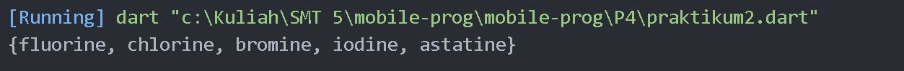

# Laporan Praktikum

NIM : 2241720087 <br>
Nama : Kinata Dewa Ariandi <br>
Kelas : TI 3B
#
##  Praktikum 1: Eksperimen Tipe Data List

Langkah 1 
```dart
void main() {
  var list = [1, 2, 3];
  assert(list.length == 3);
  assert(list[1] == 2);
  print(list.length);
  print(list[1]);

  list[1] = 1;
  assert(list[1] == 1);
  print(list[1]);
}
```
Langkah 2 : 
Hasil


penjelasan : 
Outputnya 3 2 1 karena list berisi 3 elemen, elemen ke-1 awalnya 2, lalu diubah menjadi 1.

Langkah 3 : 
```dart
void main() {
  final List<String?> list = List.filled(5, null);
  list[1] = "Kinata Dewa Ariandi";
  list[2] = "2241720087";

  assert(list.length == 5);
  assert(list[1] == "Kinata Dewa Ariandi");
  assert(list[2] == "2241720087");

  print(list.length);
  print(list[1]);
  print(list[2]);
}
```
Hasil : 


##  Praktikum 2: Eksperimen Tipe Data Set

Langkah 1 : 
```dart
void main() {
  var halogens = {'fluorine', 'chlorine', 'bromine', 'iodine', 'astatine'};
  print(halogens);
}
```

Langkah 2 : 

menampilkan/print semua isi pada halogens <br> <br>

Langkah 3 : 
```dart
void main() {
  var halogens = {'fluorine', 'chlorine', 'bromine', 'iodine', 'astatine'};
  print(halogens);

  var names1 = <String>{}; // Set<String>
  Set<String> names2 = {}; // Set<String>
  var names3 = {}; // Creates a map, not a set.

  names1.add("Kinata Dewa Ariandi");
  names1.add("2241720087");

  // Menambahkan elemen nama dan NIM ke names2
  names2.addAll(
      {"Kinata Dewa Ariandi", "2241720087"}); // Ganti dengan nama dan NIM Anda

  print(names1);
  print(names2);
  print(names3); // Ini adalah map kosong, bukan set
}
```

Hasil : 


## Praktikum 3: Eksperimen Tipe Data Maps

Langkah 1 : 
```dart
void main() {
  var gifts = {
    // Key:    Value
    'first': 'partridge',
    'second': 'turtledoves',
    'fifth': 1
  };

  var nobleGases = {
    2: 'helium',
    10: 'neon',
    18: 2,
  };

  print(gifts);
  print(nobleGases);
}

```

Langkah 2: 

jawab : 

Langkah 3 :
